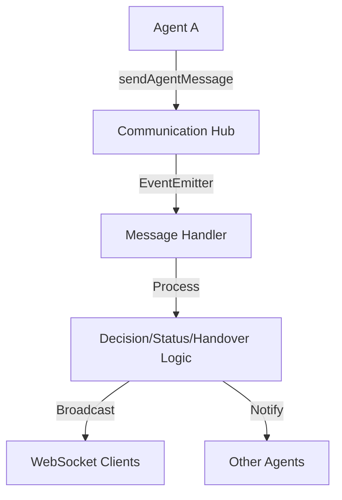
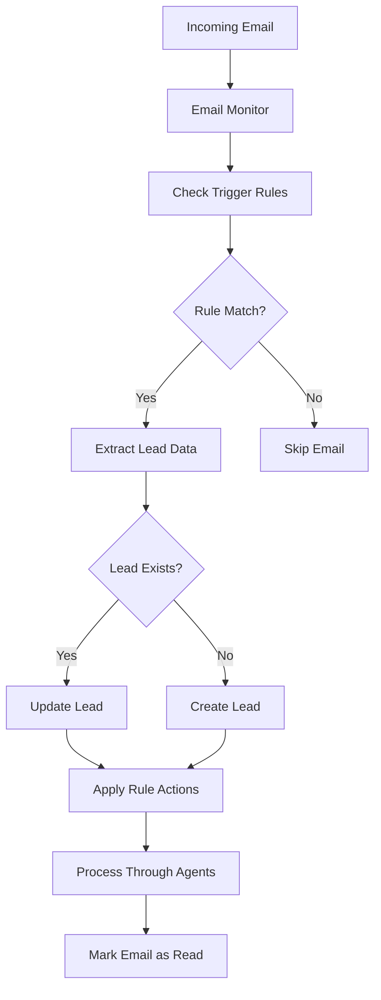

# Agent Communication Hub & Email Monitoring System

## Overview

This document describes the enhanced Agent Communication Hub and Email Monitoring System implemented in CCL-3. These components enable real-time agent-to-agent communication, goal tracking, and automated lead creation from incoming emails.

## 1. Agent Communication Hub

### Features

#### Real-time Agent-to-Agent Communication
- **Message Types**: decision, status, handover, goal_update, coordination
- **Event-driven Architecture**: Built on EventEmitter for asynchronous message handling
- **WebSocket Integration**: Real-time updates to connected clients

#### Message Passing System
```typescript
// Send a message between agents
await communicationHub.sendAgentMessage(
  'email-agent',     // from
  'sms-agent',       // to
  'handover',        // type
  {
    leadId: 'lead-123',
    reason: 'Customer prefers SMS communication',
    context: { conversationHistory, preferences }
  }
);
```

#### Decision Coordination
- Agents can request feedback from other agents before making decisions
- Consensus building through aggregated feedback
- Configurable coordination strategies

#### Goal Progress Tracking
- Track campaign goals per lead
- Automatic completion detection
- Real-time progress updates via WebSocket

### API Usage

#### Initialize Communication Hub
```typescript
import { communicationHubService } from './services/communication-hub-service';
import { WebSocketMessageHandler } from './websocket/message-handler';

// Initialize with WebSocket handler
const wsHandler = new WebSocketMessageHandler(wss, leadProcessor, broadcastFn);
communicationHubService.initialize(wsHandler);
```

#### Send Agent Messages
```typescript
// Request handover
await communicationHubService.requestHandover(
  'email-agent',
  'chat-agent',
  'lead-123',
  'Customer requested live chat',
  { conversationHistory }
);

// Coordinate decision
await communicationHubService.coordinateDecision(
  'overlord',
  'lead-123',
  { action: 'assign_channel', channel: 'email' },
  true // requires coordination
);

// Update goal progress
await communicationHubService.updateGoalProgress(
  'campaign-123',
  'lead-123',
  'emails_sent',
  1
);
```

### Message Flow



## 2. Email Monitoring System

### Features

#### IMAP/POP3 Email Client
- Connects to any IMAP server
- Periodic checking (every 30 seconds)
- Real-time notifications when supported
- Marks emails as read after processing

#### Email Parser
- Extracts lead information (name, email, phone)
- Parses email content (subject, body, attachments)
- Intelligent name extraction from email addresses

#### Campaign Trigger Engine
- Rule-based email processing
- Configurable trigger conditions
- Automatic lead creation and campaign assignment

### Configuration

#### Environment Variables
```env
IMAP_HOST=imap.gmail.com
IMAP_PORT=993
IMAP_USER=your-email@domain.com
IMAP_PASSWORD=your-app-password
```

#### Default Trigger Rules

1. **Auto Loan Inquiry**
   - Matches: subject containing "auto loan", "car loan", "vehicle financing"
   - Actions: Create lead, assign to auto-loan-campaign, set high priority

2. **Contact Form Submission**
   - Matches: from addresses containing "noreply@", "contact@", "form@"
   - Actions: Create lead, tag as "website-lead"

3. **General Inquiry**
   - Matches: Any email not caught by other rules
   - Actions: Create lead with normal priority

### API Endpoints

#### Trigger Rules Management

**GET /api/email-monitor/rules**
- Get all email trigger rules

**POST /api/email-monitor/rules**
- Create a new trigger rule
```json
{
  "name": "Premium Lead",
  "enabled": true,
  "conditions": {
    "subject": "premium|vip|urgent",
    "hasAttachment": true
  },
  "actions": {
    "createLead": true,
    "assignCampaign": "premium-campaign",
    "setPriority": "urgent",
    "addTags": ["premium", "urgent"]
  }
}
```

**PUT /api/email-monitor/rules/:id**
- Update an existing rule

**DELETE /api/email-monitor/rules/:id**
- Delete a rule

#### Monitor Control

**GET /api/email-monitor/status**
- Get monitor status and configuration

**POST /api/email-monitor/start**
- Start the email monitor

**POST /api/email-monitor/stop**
- Stop the email monitor

**POST /api/email-monitor/test**
- Test email processing with mock data

### Email Processing Flow



## 3. Integration Example

### Complete Flow: Email to Agent Processing

```typescript
// 1. Email arrives and matches trigger rule
const email = {
  from: 'john.doe@example.com',
  subject: 'Interested in auto loan',
  body: 'I need a $25,000 loan for a new car...'
};

// 2. Email monitor creates lead
const lead = {
  id: 'lead-456',
  name: 'John Doe',
  email: 'john.doe@example.com',
  source: 'email-inquiry',
  campaignId: 'auto-loan-campaign'
};

// 3. Lead processor triggers agent workflow
await leadProcessor.processNewLead(lead);

// 4. Overlord assigns to email agent
await communicationHub.sendAgentMessage('overlord', 'email', 'decision', {
  leadId: lead.id,
  decision: { action: 'assign_channel', channel: 'email' }
});

// 5. Email agent sends initial response
const response = await emailAgent.processInitialContact(lead);
await emailAgent.sendEmail(lead.email, response);

// 6. Update goal progress
await communicationHub.updateGoalProgress(
  lead.campaignId,
  lead.id,
  'initial_contact',
  1
);

// 7. Real-time update via WebSocket
// Clients receive: { type: 'goal_progress_update', data: {...} }
```

## 4. Monitoring and Debugging

### Logs
- Email processing: Look for "Processing email" logs
- Rule matches: "Email matched trigger rule"
- Lead creation: "Created new lead from email"
- Agent messages: "Agent message sent"
- Goal updates: "goal_progress_update" WebSocket messages

### Common Issues

1. **Email monitor not starting**
   - Check IMAP credentials
   - Verify firewall allows IMAP port (usually 993)
   - Enable "less secure app access" or use app password

2. **Emails not being processed**
   - Check trigger rules are enabled
   - Verify email matches rule conditions
   - Check logs for parsing errors

3. **Agent messages not delivered**
   - Ensure WebSocket connection is established
   - Verify agents are properly initialized
   - Check for errors in message handlers

## 5. Security Considerations

- IMAP passwords should use app-specific passwords
- Email content is sanitized before storage
- Trigger rules use RegExp for pattern matching (be careful with user input)
- All API endpoints require authentication
- WebSocket connections should use WSS in production

## 6. Performance Optimization

- Email checking runs every 30 seconds (configurable)
- Processed emails are marked as read to avoid reprocessing
- Agent messages are stored in memory (consider Redis for scaling)
- Goal progress is cached per campaign/lead combination
- WebSocket broadcasts are throttled to prevent flooding

## 7. Future Enhancements

1. **Email Monitoring**
   - Support for OAuth2 authentication
   - Multiple mailbox monitoring
   - Email template detection
   - Attachment processing

2. **Agent Communication**
   - Message persistence (Redis/Database)
   - Message retry mechanism
   - Agent health monitoring
   - Load balancing between agents

3. **Integration**
   - Slack/Teams notifications
   - CRM synchronization
   - Analytics dashboard
   - A/B testing for responses 